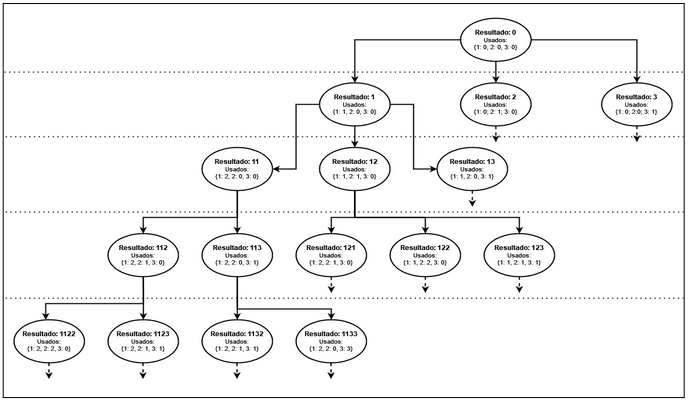
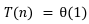
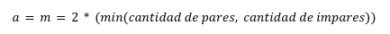
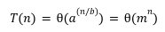
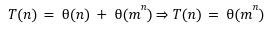
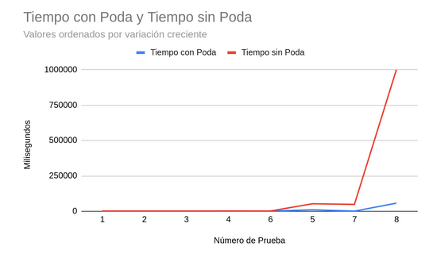
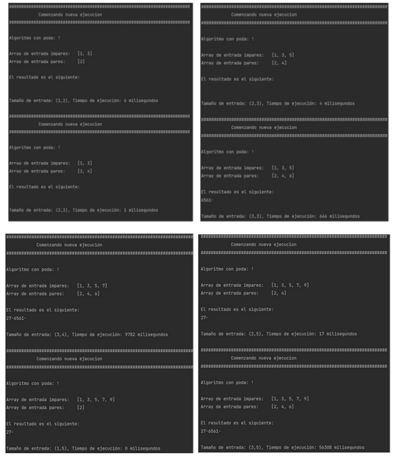
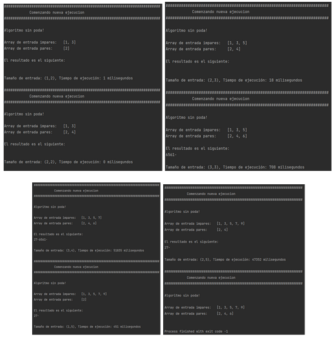
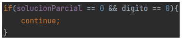

## Acerca de

Trabajo práctico obligatorio, materia Diseño y Análisis de Algoritmos (Programación III), Universidad Argentina de la Empresa. 

Profesores:
* Cuadrado Estrebou, María Fernanda
* Leonetti, Cesar Osvaldo

Alumnos:
* Zarlenga, Ignacio
* Serra, Juan Cruz Bautista
* Vidal, Manuel
* Vergara Zatti, Darío Alberto
* Nanzer, Brian


## Introducción

El presente documento plantea la resolución de la problemática de búsqueda de múltiplos de 3 combinando dígitos provenientes de dos conjuntos de datos. En este escenario, se desarrollará un algoritmo que sea capaz de generar un listado de números que cumplan las restricciones particulares del problema. Para lograrlo, se utilizará la técnica de Backtracking, que implica analizar todas las combinaciones posibles, y al mismo tiempo descartar aquellas que no son relevantes o no cumplen con los criterios establecidos. Para finalizar, se programará la solución en el lenguaje Java para poder analizar cómo varía la complejidad temporal práctica con diferentes conjuntos de entrada, comparando los resultados obtenidos contra la complejidad temporal teórica que se calculará previamente. 


## Descripción del Problema

Se desea encontrar todos los números potencia de 3 que surjan a partir de la combinación de números de un dígito pares e impares; las potencias resultantes deben tener igual cantidad de dígitos pares que impares. Los dígitos que se utilizarán serán datos del problema, los cuales  pueden ir del 0 al 9, recibiendo estos en dos conjuntos separados, uno de pares y otro de impares. Cada dígito podrá ser utilizado hasta dos veces. Se realiza la resolución del problema utilizando la técnica de backtracking. Para llevarlo a cabo tendremos como entrada:


* Un grupo de dígitos pares.
* Un grupo de dígitos impares.

Como resultado se deben obtener todos los números potencia de 3 con la condición indicada anteriormente.


## Estrategia de Resolución

Conforme a las indicaciones planteadas, la estrategia de resolución aplicada fue la de Backtracking. Esta estrategia consta del análisis exhaustivo de todas las posibilidades a partir del dato de entrada, en este caso los conjuntos de números pares e impares, a excepción de las descartadas mediante la “poda”, que identifica todas las opciones que pueden determinarse como no viables sin la necesidad de evaluarlas, a través de un criterio especial derivado de las condiciones del problema. El Backtracking contempla la evaluación de las distintas posibilidades viables en cada “nivel” en el que se subdivida la resolución del problema propuesto. 

En nuestra propuesta de solución, consideramos como “niveles” cada una de las cifras de los números resultantes. Por ejemplo, si el resultado de un recorrido es “27”, el primer nivel sería “2”, y el segundo “7”.

De esta manera, para cada nivel se realiza una evaluación de todas las opciones disponibles, y se seleccionan todas las que se consideran viables. El criterio de viabilidad está definido por las condiciones establecidas en el planteo de la problemática: Que el número resultante cuente con igual cantidad de cifras pares e impares, y que cada número se use como máximo dos veces. Una vez seleccionada una cifra, se evalúa si el número resultante es una posible solución del problema (es decir, si es múltiplo de 3), y si lo es, se lo muestra en pantalla. 

Para llevar control de la viabilidad de la utilización de cada cifra, se llevan dos controles distintos. Por un lado, cada vez que un número es utilizado, se incrementa un contador que después se utiliza para determinar si ya se utilizó el máximo de veces permitidas. Por el otro, al inicio del algoritmo se calcula la cantidad máxima de cifras utilizables de cada conjunto, determinada por la entrada de menor extensión. Este control representa la estrategia de poda. Es decir, si se cuenta con 2 números pares y 3 impares, puesto que cada uno puede utilizarse hasta 2 veces, y los resultados deben tener la misma cantidad de dígitos de ambos conjuntos, estos pueden tener como máximo 4 cifras pares y 4 impares (8 cifras en total). De esta manera, a pesar de que se cuenta con 3 números impares (que podrían generar hasta 6 cifras), una vez que se alcanza el número máximo de cifras viables, éstas dejan de evaluarse.

El siguiente diagrama muestra el comportamiento del algoritmo en sus primeros 4 niveles para la entrada de ejemplo {1, 3} como números impares, y {2} como números pares.





**_Figura 01. Diagrama de ejemplo que muestra el comportamiento de la estrategia propuesta en sus primeros 4 niveles._**


## Pseudocódigo del Algoritmo de Resolución del Problema

La solución propuesta contempla la utilización de 3 algoritmos. El primero de ellos, esPotenciaDeTres, se encarga de evaluar la solución parcial y determinar si es potencia de 3.


```
Algoritmo esPotenciaDeTres
Entradas: número: entero
Salida: s: boolean
    logaritmo ← log(número) / log(3)
    devolver esEntero(logaritmo)
fin Algoritmo
```


** _Figura 02. Pseudocódigo del algoritmo “esPotenciaDeTres”._**

El siguiente algoritmo, obtenerCombinaciones, representa la aplicación de la técnica de Backtracking: se encarga de mostrar las soluciones parciales, y cuenta con un llamado recursivo que permite la evaluación de todas las posibilidades viables. 


```
Algoritmo obtenerCombinaciones
Entradas: digitos: vector<entero>, solucionParcial: vector<entero>, cantidadPares: entero, cantidadImpares: entero, contador: vector<entero>, maximosParesPosibles: entero, maximosImparesPosibles: entero

    // Impresión de resultados correctos
    Si (cantidadPares = cantidadImpares) y esPotenciaDeTres(solucionParcial)
        mostrar(solucionParcial)
    fin Si

    para i = 0 hasta longitud(digitos) - 1
  esPar ← digitos[i] % 2 = 0

        // Entra sólo si es par y todavía puedo usar pares
       Si (contador[digitos[i]] < 2) y esPar y (maximosParesPosibles > 0)

            /* Agrega el nuevo dígito al final corriendo la solución parcial
               un número a la izquierda */
            solucionParcial ← (solucionParcial * 10) + dígitos[i] 

            // Actualización de las variables de poda (bajar un nivel)
            contador[digitos[i]] ← contador[digitos[i]] + 1
            cantidadPares ← cantidadPares + 1
            maximosParesPosibles ← maximosParesPosibles - 1

            // Llamado para continuar evaluando las demás posibilidades
            obtenerCombinaciones(dígitos, solucionParcial, cantidadPares,
                cantidadImpares, contador, maximosParesPosibles,
                maximosImparesPosibles)

            // Ya recorrimos todas las posibilidades, sacamos el dígito
            solucionParcial ← (solucionParcial - dígitos[i]) / 10

            // Actualización de las variables de poda (subir un nivel)
            contador[dígitos[i]] ← contador[digitos[i]] - 1
            cantidadPares ← cantidadPares - 1
            maximosParesPosibes ← maximosParesPosibles + 1

        fin si

        // Entra sólo si es impar y todavía puedo usar impares
        Sino si (contador[digitos[i]]<2) y !esPar y (maximosImparesPosibles>0)

            /* Agrega el nuevo dígito al final corriendo la solución parcial
               un número a la izquierda */
            solucionParcial ← solucionParcial*10 + dígitos[i]

            // Actualización de las variables de poda (bajar un nivel)
            contador[digitos[i]] ← contador[digitos[i]] + 1
            cantidadImpares ← cantidadImpares + 1
            maximosImparesPosibles ← maximosImparesPosibles - 1

            // Llamado para continuar evaluando las demás posibilidades
            obtenerCombinaciones(dígitos, solucionParcial, cantidadPares,
                cantidadImpares, contador, maximosParesPosibles,
                maximosImparesPosibles)

            // Ya recorrimos todas las posibilidades, sacamos el dígito
            solucionParcial ← (solucionParcial - dígitos[i]) / 10

            // Actualización de las variables de poda (subir un nivel)
            contador[digitos[i]] ← contador[digitos[i]] - 1
            cantidadImpares ← cantidadImpares - 1
            maximosImparesPosibes ← maximosImparesPosibles + 1

        fin si

    fin para

fin Algoritmo
```


** _Figura 03. Pseudocódigo del algoritmo “obtenerCombinaciones”._**

El último algoritmo, buscarPotenciaDeTres, es el primero que se ejecuta, y se encarga de inicializar las variables necesarias y realizar el primer llamado al algoritmo de backtracking. 


```
Algoritmo buscarPotenciasDeTres
Entradas: pares: vector<entero>, impares: vector<entero>

    // Juntamos todas las cifras en un único vector
    digitos ← InicializarVector(longitud(pares)+longitud(impares))
    i ← 0
    para cada par ∈ pares
        digitos[i] ← par
        i ← i + 1
    fin para
    para cada impar ∈ impares
        digitos[i] ← impar
        i ← i + 1
    fin para 

    // Inicialización de variables de poda
    contador ← InicializarVector(10)
    para cada digito ∈ digitos
        contador[digito] ← 0
    fin para
    maximaCantidadDeCifrasPorTipo ←
        min( (longitud(pares) * 2), (longitud(impares) * 2) )
    maximosParesPosibles ← maximosImparesPosibles ←
        maximaCantidadDeCifrasPorTipo

    // Inicialización de variables de backtracking
    solucionParcial ← 0
    cantidadPares ← 0
    cantidadImpares ← 0

    // Llamado inicial al backtracking
    obtenerCombinaciones(digitos, solucionParcial, cantidadPares,
    cantidadImpares, contador, maximosParesPosibles, maximosImparesPosibles)

Fin Algoritmo
```


** _Figura 04. Pseudocódigo del algoritmo “buscarPotenciaDeTres”._**


## Análisis de Complejidad Temporal


### Análisis de Complejidad Temporal Teórica

Para el cálculo de la complejidad temporal teórica, se realizó un análisis para cada uno de los algoritmos diseñados y descritos anteriormente: _esPotenciaDeTres_, _obtenerCombinaciones _y _buscarPotenciasDeTres_, para luego sumar los resultados obtenidos y determinar la complejidad de la solución propuesta.

El primero de ellos, _esPotenciaDeTres_, encargado de determinar si un resultado parcial es una potencia de 3, se encuentra compuesto únicamente de operaciones constantes, por lo que su complejidad temporal es de 



El segundo, _obtenerCombinaciones_, es el algoritmo en el que se aplica la estrategia de backtracking, por lo que cuenta con llamados recursivos. En cada instancia se evalúa la utilización de una cifra del conjunto de pares e impares, por lo que se concluye que la complejidad temporal está basada en la sustracción, con la variable de la fórmula de recursividad "b = 1", ya que el problema se simplifica en una unidad en cada llamado.

Por otra parte, la variable “a” de la fórmula, que representa la cantidad de llamados recursivos en el peor de los casos, surge del ciclo “para” del algoritmo. En este, se recorre la totalidad de cifras del conjunto de entrada, y se realiza un llamado recursivo para cada una de las cifras válidas. Dicha validez depende de la estrategia de poda, que establece una cantidad máxima para cualquiera de los dos tipos de cifra (pares e impares). De esta manera, en la mayoría de los casos, no se evalúan todas las cifras de un conjunto una vez excedida la cantidad máxima permitida para cada tipo de cifra. Así, en la mayoría de casos, “a” toma el valor “m”, igual al doble del mínimo entre la cantidad de cifras pares e impares de la entrada.




** _Figura 05. Definición del valor de “a” en “obtenerCombinaciones”._**

En el peor de todos los casos, la entrada cuenta con igual cantidad de números pares e impares, por lo que se evaluará la totalidad del conjunto de entrada en cada iteración del algoritmo. En dicho caso, “a” toma el valor “n”, igual a la entrada (suma de la cantidad de cifras pares e impares). Este resultado también se obtiene aplicando la fórmula definida para “m” en entradas con igual cantidad de pares e impares, por lo que se utilizará esta variable en todos los casos.

En cuanto al resto de las operaciones del algoritmo, cuyo grado determina el valor de la variable “k” de la fórmula, se observa que son todas de complejidad constante, incluyendo la de _esPotenciaDeTres_, calculada previamente. Así, se concluye que "k = 0".

De esta manera, con "a = m", "b = 1", "k = 0", es posible aplicar la fórmula del cálculo de la complejidad temporal en casos de recurrencia por sustracción. Debido a que “n”, el valor de “a”, corresponde a la cantidad de dígitos de entrada, y que por ende esta cantidad no puede ser igual a 0 ni a 1, puede concluirse que siempre se dará el caso en el que "a > 1", por lo que la fórmula que corresponde es:


 \
** _Figura 06. Cálculo de complejidad del algoritmo “obtenerCombinaciones”._**

Finalmente, el algoritmo _buscarPotenciasDeTres,_ encargado de inicializar variables y realizar el primer llamado al backtracking, tiene una complejidad temporal de "O(n)", siendo “n” la suma de las cifras pares e impares de entrada. Esto se debe a que el algoritmo, para la inicialización de las variables que se utilizan en el backtracking, realiza recorridos iterativos sobre los arreglos de cifras. 

De esta manera, la complejidad temporal teórica del algoritmo se encuentra dada por la suma de las complejidades de _buscarPotenciasDeTres_ y _obtenerCombinaciones_. Sin embargo, debido a que el grado de complejidad del segundo algoritmo es muchísimo mayor al del primero, la complejidad temporal queda determinada por este. 


\
** _Figura 07. Cálculo de complejidad temporal general._**


### Análisis de Complejidad Temporal Práctica

Para el análisis de la complejidad temporal práctica del algoritmo, se llevó a cabo una serie de pruebas con conjuntos de datos conocidos. El objetivo principal fue determinar el impacto real de la estrategia de poda implementada, orientada a disminuir el tiempo de procesamiento, anticipándose a opciones incapaces de producir resultados que cumplieran con la condición.

Como se describió anteriormente, dicha estrategia consiste en determinar la cantidad máxima de cifras utilizables de un conjunto en el resultado final. Explicado en términos simples, una vez que ya se hayan utilizado todas las cifras pares posibles y se haya alcanzado un resultado con igual cantidad de cifras pares e impares, no tiene sentido evaluar números con más cifras impares, si las hubiera, ya que cualquier resultado que se produzca siempre tendrá más cifras de un conjunto que del otro, y será, por ende, un resultado inválido. Lo mismo es cierto a la inversa. 

Con esto en mente, se definieron 8 conjuntos de prueba, y se evaluó la ejecución del algoritmo para cada uno de ellos, con y sin estrategia de poda. Los conjuntos de prueba son: 


<table>
  <tr>
   <td><strong>Número de prueba</strong>
   </td>
   <td><strong>Cifras Pares</strong>
   </td>
   <td><strong>Cifras Impares</strong>
   </td>
  </tr>
  <tr>
   <td>1
   </td>
   <td>2
   </td>
   <td>1, 3
   </td>
  </tr>
  <tr>
   <td>2
   </td>
   <td>2, 4
   </td>
   <td>1, 3
   </td>
  </tr>
  <tr>
   <td>3
   </td>
   <td>2, 4
   </td>
   <td>1, 3, 5
   </td>
  </tr>
  <tr>
   <td>4
   </td>
   <td>2, 4, 6
   </td>
   <td>1, 3, 5
   </td>
  </tr>
  <tr>
   <td>5
   </td>
   <td>2, 4, 6
   </td>
   <td>1, 3, 5, 7
   </td>
  </tr>
  <tr>
   <td>6
   </td>
   <td>2
   </td>
   <td>1, 3, 5, 7, 9
   </td>
  </tr>
  <tr>
   <td>7
   </td>
   <td>2, 4
   </td>
   <td>1, 3, 5, 7, 9
   </td>
  </tr>
  <tr>
   <td>8
   </td>
   <td>2, 4, 6
   </td>
   <td>1, 3, 5, 7, 9
   </td>
  </tr>
</table>


** _Figura 08. Conjuntos de prueba._**

Los resultados reales obtenidos de las pruebas son los siguientes:


<table>
  <tr>
   <td><strong>Número de Prueba</strong>
   </td>
   <td><strong>Tiempo con Poda</strong>
   </td>
   <td><strong>Tiempo sin Poda</strong>
   </td>
   <td><strong>Variación</strong>
   </td>
  </tr>
  <tr>
   <td>1
   </td>
   <td>1 ms
   </td>
   <td>1 ms
   </td>
   <td>0 ms
   </td>
  </tr>
  <tr>
   <td>2
   </td>
   <td>0 ms
   </td>
   <td>1 ms
   </td>
   <td>1 ms
   </td>
  </tr>
  <tr>
   <td>3
   </td>
   <td>4 ms
   </td>
   <td>18 ms
   </td>
   <td>14 ms
   </td>
  </tr>
  <tr>
   <td>4
   </td>
   <td>646 ms 
   </td>
   <td>708 ms
   </td>
   <td>62 ms
   </td>
  </tr>
  <tr>
   <td>5
   </td>
   <td>9782 ms
   </td>
   <td>51835 ms
   </td>
   <td>42053 ms
   </td>
  </tr>
  <tr>
   <td>6
   </td>
   <td>0 ms
   </td>
   <td>451 ms
   </td>
   <td>451 ms
   </td>
  </tr>
  <tr>
   <td>7
   </td>
   <td>17 ms
   </td>
   <td>47352 ms
   </td>
   <td>47335 ms
   </td>
  </tr>
  <tr>
   <td>8
   </td>
   <td>56308 ms
   </td>
   <td>No obtenido
   </td>
   <td>N/A
   </td>
  </tr>
</table>


** _Figura 09. Resultados obtenidos, comparación entre algoritmos con y sin poda._**

El siguiente gráfico muestra una comparación entre los resultados obtenidos para ambos conjuntos de pruebas. En este, se ordenaron los datos por variación entre tiempos, en orden creciente. Para poder representar el caso de prueba 8, para el que no se pudo obtener un tiempo de ejecución sin poda debido a limitaciones en capacidad de cómputo, se introdujo el valor arbitrario “999.999 ms”. 



\
** _Figura 10. Resultados obtenidos, comparación entre algoritmos con y sin poda._**

A partir del análisis de los resultados obtenidos y la comparación entre los distintos conjuntos de pruebas,  se llegó a las siguientes conclusiones:


* La estrategia de poda utilizada logra mejorar el tiempo de ejecución de manera significativa cuando el tamaño de los dos vectores de entrada es diferente. En detalle, mientras mayor la diferencia entre los tamaños, mayor el ahorro en tiempo de ejecución. Tanto es así que para uno de los casos estudiados sólo pudo obtenerse un resultado final utilizando la poda, ya que sin ella el algoritmo nunca finalizaba su ejecución.
* Cuando el tamaño de los vectores de entrada es similar (o, en el peor de los casos, igual), no se obtiene una mejora significativa utilizando la estrategia de poda propuesta. 





** _Figura 11. Capturas de pantalla de la salida por terminal de las pruebas realizadas._**

De esta manera, se ha logrado demostrar heurísticamente que al utilizar una estrategia tan compleja en cuanto a lo temporal como lo es el ‘backtracking’, es esencial buscar la máxima posibilidad de poda.


## Conclusiones

La problemática planteada representó un desafío complejo que requirió la utilización de una técnica de alto costo computacional, el backtracking. Luego de varias iteraciones respecto a la solución ideal, se logró obtener un algoritmo que, a pesar de tener una elevada complejidad temporal en su peor caso, cuenta con una estrategia de “poda”, que ayuda a prevenir iteraciones que a priori se sabe que no conducirán a ningún resultado válido.

Esta estrategia logra que, para entradas con cantidades diferentes de cifras pares e impares, no se continúe iterando sobre uno de los conjuntos cuando el otro se haya agotado. Tal como se ha descrito en el apartado de cálculo de complejidad temporal práctica, la utilización de esta estrategia ha representado un ahorro significativo en los tiempos de procesamiento para los casos que previene.

Cabe destacar que, para entradas particularmente grandes, como la del caso de prueba 08, el costo computacional sin la estrategia de poda es tal que no se logró obtener un resultado, las computadoras en las que se probó simplemente nunca terminaban la ejecución del algoritmo. De esta manera, queda demostrada la importancia de implementación de este tipo de estrategias en soluciones de backtracking para que los algoritmos sean viables.

En base a lo observado, se concluye que, aunque la estrategia de backtracking genera soluciones complejas y de alto costo computacional, la realización de un diseño inteligente, que incluya estrategias que prevengan la evaluación innecesaria de alternativas incapaces de producir resultados viables, puede generar resultados en un tiempo perfectamente utilizables en un ámbito práctico real.

Un pequeño detalle a aclarar es que, a la hora de implementar la solución, partiendo de la estrategia planteada en pseudocódigo, se descubrió que había un caso en el que la implementación fallaba: si el 0 es el primer dígito analizado. Es por esto por lo que se agregó al programa una pequeña lógica que evita analizar el 0 como primer dígito, evitando así este caso especial. A continuación, se muestra una imagen de la lógica agregada:



** _Figura 12. Lógica para evitar que el número comience con 0.._**

Este fragmento de código evita que en el primer nivel se analice el 0 como primer dígito, saltándolo y evitando incrementar su contador como si hubiera sido utilizado.
